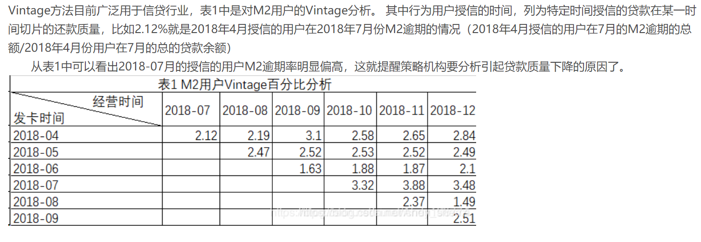
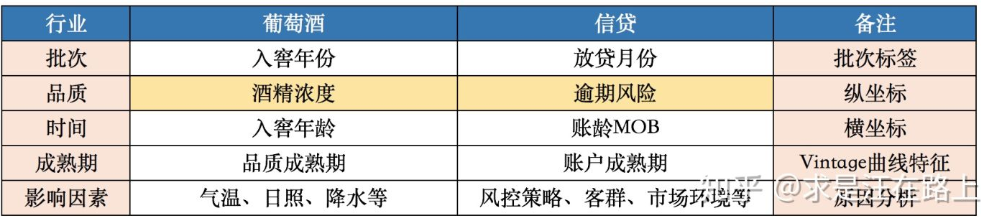
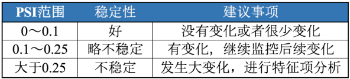
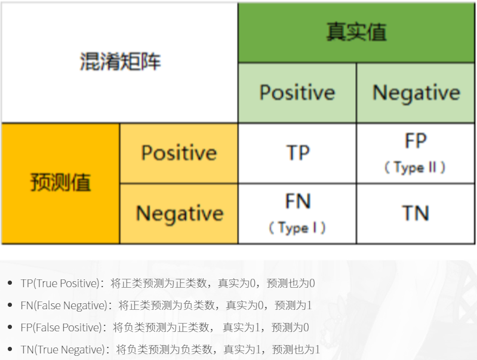

# 信用风险控制

>从信贷产品开发角度而言，结合客户行为和客群定位，梳理客户从何种渠道而来、基于何种需求选择、以及在何种场景中决定借款及还款，才能形成信贷产品管理的完整闭环，确认这笔生意能否盈利。

确保用户能还钱，否则得赔死。

>从风险管理角度而言，渠道、场景和客群分析同样重要。以往很多时候，当我们谈起一家公司的风控指标，我们往往会关注这个团队是否有足够的能力去做风控模型、审批核额、贷后管理以及资产回收。一笔优质的资产的产生，虽然对于风险管理团队来说是大多始于审批，终于还款或者催收；但对于整个公司而言，决定逾期率水平的，最重要的却往往不是这些狭义的风控能力，而是更前端、更本质的信贷产品设计逻辑。

前有策略审批，后有风控模型进行控制，对用户进行筛查，评估与预测，环环相扣。。

以趣店为例


# 风控指标


**账龄**

指资产放款月份。类似于婴孩一出生就有了年龄，一旦申贷订单被放款，也便拥有了账龄和生命周期。

- MOB0：放款日至当月月底(那么说29号放的款，一直到31号就是MB0了)？
- MOB1：放款后第二个完整的月份
- MOB2：放款后第三个完整的月份

MOB的最大值**取决于信贷产品期限**。如果是12期产品，那么该资产的生命周期是12期，MOB最大到MOB12。

例如，2019年11月13日放款的订单，2019年11月是MOB0，2019年12月是MOB1，以此类推

**逾期天数**

逾期天数(Days Past Due，DPD)

逾期天数 = 实际还款日 - 应还款日。

DPDN+表示逾期天数 >= N天，如DPD30+表逾期天数 >=30天的资产

例如，若还款日是每月8号，那么9号就是逾期第一天。如果客户在10号还款，那么逾期2天

**逾期期数(M)**

指实际还款日与应还款日之间的逾期天数，并按区间划分后的逾期状态。M取自Month on Book的第一个单词。（注：不同机构所定义的区间划分可能存在差异）

M0：当前未逾期（或用C表示，取自Current）
M1： 逾期1-30日
M2：逾期31-60日
M3：逾期61-90日
M4：逾期91-120日
M5：逾期121-150日
M6：逾期151-180日
M7：逾期180日以上。此时也被称为呆账（Bad Debts），会予以注销账户（write-off）

- 观察点（ObservationPoint）：并非是一个具体的时间点，而是一个时间区间，表示的是客户申请贷款的时间。在该时间段申请的客户可能会是我们用来建模的样本 。（提示：为什么用“可能”这个描述，因为还需剔除一些强规则命中的异常样本，这部分样本将不会加入建模）
- 观察期（ObservationWindow）：用以构造特征X的时间窗口。相对于观察点而言，是历史时间。观察期的选择依赖于用户数据的厚薄程度。通常数据越厚，可提取的信息也就越全面、可靠。
- 表现期（PerformanceWindow）：定义好坏标签Y的时间窗口。相对于观察点而言，是未来时间。由于风险需要有一定时间窗才能表现出来，因此信贷风险具有滞后性。表现期的长短可以通过Vintage分析和滚动率分析来确定，在此不做展开。

## 逾期率的定义

>The coincidental delinquency provides the delinquency of the portfolio as at the end of a particular period, taking into consideration the entire portfolio outstanding, including the account booked into the portfolio as on that date.

一种是截止某一时间点的逾期金额，除以当前在贷的贷款余额；

>The lagged delinquency method, measure the real delinquency of the portfolio, without considering the disbursements made in the recent months. The delinquency on any one bucket, is matched with the portfolio, that has originated the delinquency.

另外一种，则是将各个月份的逾期金额，与各个月份放款的贷款余额做比对，这样就不会受到不断增长的累计放款的影响了。具体计算口径可以有M2+lagged%，M3+lagged%等，根据需要统计各期发放贷款的表现。

- 第一种，订单口径，逾期率 = 逾期订单数 / 总放贷订单数
- 第二种，金额口径，逾期率 = 逾期金额 / 总放贷金额

控制逾期率的方法

1.渠道：客户导流以趣店为例[@小菜鸟的互联网金融笔记]
2.场景：

## 一手客户

一手客户:假设当客户有借款需求的时候第一个能想到的平台是A平台，而B平台则是在客户借了很多平台不得已而为之的选择，那么B平台相对而言得到的是资质较差的客户（比如贷款超市导流的客户）


## Vintage Analysis

>传统的销售统计报表大多数情况下只是将不同渠道、不同时间、不同产品的数据进行统计，是顺序的，平面的。vintage将不同时期的数据拉平到同一时期比较，可以很直观地比较和反思不同时期公司的营销策略的效果[@weixin]

>分析的方法是针对不同时期产生的信贷账户分别进行跟踪，按照账龄的长短进行同步对比，从而了解不同时期批准账户的资产质量情况，是一个所谓竖切的概念[@简书]

举个栗子
```{r}

```

>Vintage一词最初来源于葡萄酒业🍇。由于每年采摘的葡萄会受到日照、气温、降水等因素的影响，最终酿造的葡萄酒品质会存在差异。在窖藏一定年份后，葡萄酒的品质将趋于稳定，也就是品质成熟，这段年份数被称为成熟期（maturity）[知乎专栏](https://zhuanlan.zhihu.com/p/81027037)


信贷领域中，我们也可以用Vintage曲线分析资产（portfolio）质量的成熟过程变化规律[知乎专栏](https://zhuanlan.zhihu.com/p/81027037)

```{r}

```

1.确定资产质量：一般以逾期率来定义资产质量，也就是曲线平缓后对应的逾期率。

2.分析变化规律：资产质量（例如逾期率指标）的变化情况，如果前几期逾期率上升很快，那么说明短期风险没有捕捉住，欺诈风险较高；反之，如果曲线一直在上升，说明信用风险识别能力不佳。

3.确定账户成熟期：用来判断客户展现好坏的时间因素，从而帮助定义表现期。

4.分析影响因素：风控策略收紧或放松、客群变化、市场环境、政策法规等都会影响资产质量。分析影响因素，可以用来指导风控策略的调整。

**为什么要分析帐户的表现期**

>表现期越长，信用风险暴露将越彻底，但意味着观察期离当前越远，用以提取样本特征的历史数据将越陈旧，建模样本和未来样本的差异也越大。反之，表现期越短，风险还未暴露完全，但好处是能用到更近的样本。

例如，对于一个12期分期还款的信贷产品，理论上当用户在12期结束，并还清所有的钱后，我们才能定义为绝对的好客户；反之，我们只能说到目前为止是一个好客户，但并不能知道未来几期用户会不会逾期不还钱。我们需要确定一个合适的表现期能覆盖足够多的坏客户即可


## Roll Rate Analysis


>滚动率：一个时间段过渡到另一个时间段内的比率变化。在信贷交易过程中，实际上是用户的还款状态由上个时间段向下个时间段滚动的比率计算。滚动率分析是风险分析定义好坏用户的重要依据。

在风险控制中，我们的根本目的是识别坏用户，通过历史数据，抓取坏客户显著区别于正常客户的特征，并以此为标准去预测未来的坏客户。用户的好坏其实很难定义，不能说逾过期的用户就是坏用户，也许人家其实想还，只是不小心忘记还款了呢。而且，有的时候，“适当”的逾期还能增加公司的逾期利息收入。我们所关注的坏客户是坏到某一程度，也就是逾期等级较高且不还款的客户。

前面说的vintage是从时间维度上判断客户群体的好坏，下面说的滚动率则是从行为程度上判断客户的好坏，它可以帮助我们判断某些逾期客户是否还可以再抢救一下，收回点成本。

滚动率，简单地说就是以某一时间点为观察节点，观察客户在该点前一段时间内（比如半年）最坏逾期阶段，并追踪其在观察点之后的一段时间向其他逾期阶段发展的情况，特别是向更坏程度发展的情况。举个栗子，今天是2018年5月25日，取今天的1万个客户，统计他们在过去半年里的最大逾期阶段。然后追踪他们后半年的表现。以下数字纯属虚构，完全是为了说明问题，各个公司有自己的观察数据和追踪数据。

M0的客户在未来半年里，98%的客户还是会保持正常M0的状态

最大逾期阶段M1的客户在未来80%会变M0，但是还有20%会继续，甚至有5%的人往更坏的程度发展

最大逾期阶段M2的客户在未来40%的人会继续恶化，22%左右的人会变M0（完全从良）；

最大逾期阶段M3的客户在未来60%的人会继续恶化，15%左右的人会变M0（完全从良）；

最大逾期阶段M3+的客户在未来80%的客户会继续此状态（没救了）。

根据以上的数据，我们可能就可以得出逾期3期以上的客户，都是无力抢救的坏客户这样的结论。假如我们想把条件收紧一点，那么我们可能会选择逾3期或者2期。再假如我要给坏设定等级，那么我就可以把3期以上设为极度坏，逾3、2期的话可能设置为中度坏，逾1期的人可以是不经意的坏。这些特征将来可以放到风控建模的样本特征中来。[@weixin]


## Flow Rate Analysis

迁移率分析法（Flow Rate）也叫做净流量滚动比例法（Net Flow Rate），能形象展示客户贷款账户在整个生命周期中的变化轨迹，也是预测未来坏账损失的最常用的方法。

逾期就是说你到了该还款的日子而没有还款，那你就进入了逾期。根据逾期天数，又分为M0-M7+等八个阶段。没有逾期的是M0，逾期1~29天的是为M1，逾期30~59的定义为M2，以此类推，逾期超过180天的定义为M7+。

有了逾期阶段的概念，迁移率就好理解了。简单说，就是**处于某一逾期阶段的客户转到其他逾期阶段的变化情况**。迁移率通常可以**用来预测不同逾期阶段的未来坏账损失**。比如，M2-M3，说的是从逾期阶段M2转到逾期阶段M3的比例。需要注意的是，我们应该选还款日为同一天的M2来做分子


>迁移率是催收常使用的绩效指标。它与vintage结合能实现风险的精细化管理。vintage的核心思想是对不同时期的同一层面的资产进行分别跟踪，按照账龄长短进行同步对比，从而了解不同时期的资产质量情况，是一个所谓竖切的概念；而迁移率能很好的提示客户整个生命周期中的衍变情况，是一个所谓横切的概念。


🌟其核心假设为：处于某一逾期状态（如M2）的账户，一个月后，要么从良为M0账户，要么恶化为更坏的下一个逾期状态（如M3）。

迁移率 = 前一期逾期金额到下一期逾期金额的转化率一般缩写为M0-M1、M4-M5等形式，例如：

M0-M1 = 当月进入M1的贷款余额 / 上月末M0的贷款余额
M2-M3 = 当月进入M3的贷款余额 / 上月末M2的贷款余额
迁移率分析的具体操作步骤为：

step 1. 定义逾期状态，如前文所述的M0、M1、M2等。
step 2. 计算各逾期状态之间的迁移率，如M0-M1、M2-M3等。
step 3. 计算不同月份（也可称为Vintage）的平均迁移率。目的是对本平台在不同时期的资产的迁移率有整体的认知。
step 4. 根据平均迁移率和不良资产回收率，计算净坏账损失率。

## 入催率

有了前面的铺垫，入催率就比较简单了。它指的是在某一个还款日，客户从M0变成M1的比例。比如说，今天，有N个M0客户到了还款日，里面有M个客户按时还款了，那么今天的入催率就是（N-M）/N。它与下面的FBD是有区别的。

## FPD

FPD是指首期逾期率，是说在某一个还款日，仅第一期到期的客户中有多少没有按时还款。与入催率的差别在于，入催率包含了第一期、第二期、第三期等等所有到期的M0。FPD一般用来做反欺诈，因为欺诈用户他第一期是根本不会还款的。

## Y变量的定义

Y变量即为客户好坏标签变量，前面的Vintage分析和滚动率分析中已经说过一些，这里做个总结。Y变量要结合滚动率分析和Vintage分析来定义，滚动率分析用于对客户好坏程度进行定义，Vintage分析用于设置合适的表现期。定义Y变量可以分为以下几步：

1、进行滚动率分析，定义坏客户，如上面所说的M4+为坏客户；

2、然后统计出M4+的Vintage数据表及Vintage图，找出成熟期；

3、表现期大于成熟期的样本可以用于建模，表现期小于成熟期的样本无法准确定义Y变量，暂时舍弃。

当然，在实际应用中，根据业务需要，Y变量的定义可以灵活变通。比如在业务刚开展不久，表现期较短，此时无法根据上述方法定义Y变量，可以暂将逾期大于10天、15天或30天的客户定义为坏等等，然后随着时间的推移不断修正Y变量及模型。

## Odds Ratio（OR）

优势：时间发生和不发生的概率
Odds $=\frac{p}{1-p}$

$$O d d s_{x_{1}}=\frac{P\left(Y=1 | x=x_{1}\right)}{P\left(Y=0 | x=x_{1}\right)}$$

OR定义

$$\begin{aligned} O R_{x2 / x1} &=\frac{O d d s_{x_{2}}}{O d d s_{x_{1}}} \\ &=\frac{P\left(Y=1 | x=x_{2}\right) / P\left(Y=0 | x=x_{2}\right)}{P\left(Y=1 | x=x_{1}\right) / P\left(Y=0 | x=x_{1}\right)} \end{aligned}$$

若是在逻辑回归中$\ln \frac{p}{1-p}=\beta_{0} x_{0}+\beta_{1} x_{1}+\ldots+\beta_{n} x_{n}$

$\begin{aligned} O R_{x_{i}+1 / x_{i}} &=\frac{O d d s_{2}}{O d d s_{1}}=\frac{p_{1} /\left(1-p_{1}\right)}{p_{2} /\left(1-p_{2}\right)} \\ &=\frac{e^{\sum_{j \neq i} \beta_{j} x_{j}+\beta_{i}\left(x_{i}+1\right)}}{e^{\sum_{j \neq i} \beta_{j} x_{j}+\beta_{i} x_{i}}} \\ &=e^{\beta_{i}} \end{aligned}$

举个栗子

\begin{aligned} \widehat{O d d s_{x_{1}}} &=\frac{\(Y=1)_{x_{1}}}{\(Y=0)_{x_{1}}}=\frac{\ B a d_{x_{1}}}{\ G o o d_{x_{1}}} 

$$O R_{x_{2} / x_{1}} &=\frac{O \widetilde{d d s_{x_{2}}}}{O \widehat{d d s_{x_{1}}}} \\ &=\frac{\# B a d_{x_{2}}}{\ B a d_{x_{1}}} * \frac{\ G o o d_{x_{1}}}{\ G o o d_{x_{2}}} \\ \ln \left(O R_{x_{2} / x_{1}}\right) &=W O E_{x_{1}}-W O E_{x_{2}} \\ &=\beta \quad i n \quad Y \sim \text {x}, \quad x \in\left\{x_{1}, x_{2}\right\} \end{aligned}$$


WOE单调实际上就意味着当 $x_i$ 从$x_1$ ...$x_1$单调上升时，相应的 $odd_{x_{i}}$ 也呈现单调递增（递减）， OR也呈单调递增（递减）。


\begin{equation}\underbrace{\ln \frac{P\left(Y=1 | x_{i}\right)}{P\left(Y=0 | x_{i}\right)}}_{\ln \left(O d d s_{x_{i}}\right)}=\underbrace{\ln \frac{P(Y=1)}{P(Y=0)}}_{\text {sample_odds }(\vec{\pi} \mathbb{B} * \underline{k})}+\underbrace{\ln \frac{P\left(x_{i} | Y=1\right)}{P\left(x_{i} | Y=0\right)}}_{W O E_{x_{i}}}\end{equation}

与bayes的关系
$$\underbrace{\ln \frac{P\left(Y=1 | x_{i}\right)}{P\left(Y=0 |x_{i}\right)}}_{\ln \left(O d d s_{x_{i}}\right)}=\underbrace{\ln \frac{P(Y=1)}{P(Y=0)}}_{\text {sample_odds }(\mathbb{H}):(k)}+\underbrace{\ln \frac{P\left(x_{i} | Y=1\right)}{P\left(x_{i} | Y=0\right)}}_{\text {Bayes Factor }}$$

>WOE也好，IV也好，做的都是单变量分析。我们认为对Y有较好预测能力的变量，在多元回归时仍然会有较好的预测能力。基于此逻辑可以用IV值来对变量的重要性进行排序[@Garvy]

## WOE

"Weight of Evidence”，即证据权重。
>WOE describes the relationship between a predictive variable and a binary target variable.我们习惯于线性判断变量的作用，当x越来越大，y就越来越大。但实际x与y之间经常存在着非线性关系，此时可经过WOE变换。

衡量特征变量与分类(目标)变量之间的关系,通俗理解为关系就是系数


>WOE 你可以理解为，我们在跑一个逻辑回归，x变量有很多，都做单变量回归，这个回归特殊，beta > 0，那么这里的 x 的 beta 就是WOE。那么 WOE 越大越好,越大说明相关性越高。(li)

- IV值可以衡量各变量对y的预测能力，用于筛选变量。
- 对离散型变量，woe可以观察各个level间的跳转对odds的提升是否呈线性，而IV可以衡量变量整体（而不是每个level）的预测能力。
>当你有千级别或者万级别的字段时，建模前计算IV值是很有必要的。以地区邮编为例，level很多，每个level下样本少，常规的处理是用dummyencoding将n个level的变量拆成n-1个哑变量，然后建模做检验，得到这n-1个哑变量的显著性，再对n-1个哑变量做聚类等处理才能feed in model。如果到最后你不管怎么处理都不太好feed进model，那就白忙了，场面会相当的尴尬。这个时候就体现了事先计算IV值来筛选变量的重要性了。

- 对连续型变量，woe和IV值为分箱的合理性提供了一定的依据。
- 分箱处理连续型变量会有信息损失，但由于绝大多数情况下连续型变量对odds的提升都不是线性的，这里能产生的负面影响远比信息损失要大，因此一般都需要做分箱处理。

简单的来说:

**处理缺失值：**当数据源没有100%覆盖时，那就会存在缺失值，此时可以把null单独作为一个分箱。这点在分数据源建模时非常有用，可以有效将覆盖率哪怕只有20%的数据源利用起来。

**处理异常值：**当数据中存在离群点时，可以把其通过分箱离散化处理，从而提高变量的鲁棒性（抗干扰能力）。例如，age若出现200这种异常值，可分入“age > 60”这个分箱里，排除影响。


- good好用户
- bad坏用户

$$W O E_{i}=\ln \left(\frac{B a d_{i}}{B a d_{T}} / \frac{G o o d_{i}}{G o o d_{T}}\right)=\ln \left(\frac{B a d_{i}}{B a d_{T}}\right)-\ln \left(\frac{G o o d_{i}}{G o o d_{T}}\right)$$


## IV

>IV measures the strength of that relationship.

在构造预测模型的时候，往往不需要将全部的变量投入模型进行训练。因此需要前筛。IV类似于信息增益，gini指标一样的，衡量特征变量的预测能力的，可以筛选预测效果更好变量进模型。

选入模变量的时候需要考虑的问题有[@jianshu]
- 变量的预测能力
- 变量之间的相关性
- 变量的简单性，容易生成和使用
- 变量的robust，不容易被绕过
- 变量业务上的可解释性等

一般来说所有特征变量的信息量是100%，因此当一个变量蕴含的信息量越大，对分类结果的好坏影响越大。

IV是WOE的加权和,加权主要是消除掉各分组中数量差异带来的误差

$I V_{i}=\left(\frac{B a d_{i}}{B a d_{T}}-\frac{G o o d_{i}}{G o o d_{T}}\right) * W O E_{i}$
$=\left(\frac{B a d_{i}}{B a d_{T}}-\frac{G o o d_{i}}{G o o d_{T}}\right) * \ln \left(\frac{B a d_{i}}{B a d_{T}} / \frac{G o o d_{i}}{G o o d_{T}}\right)$
$I V=\sum_{i=1}^{n} I V_{i}$

## PSI

PSI(Population Stability Index)叫做群体稳定性指标，用于衡量两组样本的评分是否有显著差异。PSI = sum(（实际占比-预期占比）*ln(实际占比/预期占比)

举个栗子，假设在训练一个评分模型时，我们将样本评分按从小到大排序分成10组，那么每组会有不同的样本数量占比P1；评分模型制作出来之后，我们试用这个模型去预测新的一组数据样本，按上面的方法同样按评分分成10组，每组也会有一定的样本数量占比P2。PSI可以帮助我们量化P1和P2，即预期占比与实际占比的差距。
这个指标同样也可以用于监测每月申请客户或成交客户的变化。

>PSI数值越小，两个分布之间的差异就越小，代表越稳定。

```{r}

```


```{r}

```


## 变异系数

变异系数（Coefficient of Variation，CV）来衡量这种数据波动水平。变异系数越小，代表波动越小，稳定性越好。

变异系数的计算公式为：变异系数 C·V =（ 标准偏差 SD / 平均值Mean ）× 100%

## 混淆矩阵

还是放一个在这里好了


## KS

区分度评估指标(KS)[ZHIHU](https://zhuanlan.zhihu.com/p/79934510)

>KS指标: 用以评估模型对好、坏客户的判别区分能力，计算累计坏客户与累计好客户百分比的最大差距

KS自然是越大越好，但是实际模型中不会超过0.5

$$K S=\max (T P R-F P R)$$

往往这个值愈大，代表模型的风险排序能力越好

## Lift chart


混淆矩阵查准率
$$P R E=\frac{T P}{T P+F P}$$
$$\text { ACC }=\frac{\mathrm{TP}+\mathrm{TN}}{\mathrm{TP}+\mathrm{TN}+\mathrm{FP}+\mathrm{FN}}$$

$$L i f t=\frac{\frac{T P}{T P+F P}}{\frac{T P+F N}{T P+F P+T N+F N}}=\frac{P R E}{ACC}=\frac{模型预测为positive中预测对的比率}{所有预测结果中判断对的比率}$$


横坐标Depth为预测成正例的比例
$$\operatorname{depth}=\frac{T P+F P}{T P+F P+T N+F N}$$

在模型中，随着改变阈值p，命中率会随之改变，lift曲线中横坐标就是改变阈值p下正比例的变化，纵坐标是lift提升度。比如命中率是80%，原来好坏比是1:1，那样就提高了1.6。

一般来说，在depth为1前，lift越大于1越好。[zhihu](https://zhuanlan.zhihu.com/p/79934510)

>Lift指标可以这样理解：在不使用模型的情况下，用先验概率估计正例的比例，即上式子分母部分，以此作为正例的命中率；利用模型后，我们不需要从整个样本中来挑选正例，只需要从我们预测为正例的那个样本的子集TP+FP中挑选正例这时正例的命中率为PRE，后者除以前者即可得提升值Lift。

一般要求，在尽量大的 depth下得到尽量大的lift，所以 **lift 曲线的右半部分应该尽量陡峭**。

## IRR

贴现率，也就是实际利率，也就是说是一个比较客观真实的评价指标

APR是年度回报率，一般来讲是等额本息的条件下比较客观，否则是可以造假的

这里
> > apr36的年化利率，其实差不多是60的实际利率
> 
> * [ ]   IRR和ARR之间的换算

只满足在等额本息还IRR的时候。

2020-01-01 借1000
2020-01-02 还1199
2021-01-01 还0001

这种情况下，IRR是非常大的，1000~2000

2020-01-01 借1000
2020-01-02 还0001
2021-01-01 还1199

那么，IRR20%

```{r}
# 1200/(1+0.2)=1000
```


因此，我们认为IRR可以让投机者钻空子少，保障借款人的利益，APR太容易让借款人不清楚借款成本。

以下是昨天开会的复现例子。

等额本息
2020-02-01 还100
...
2021-01-01 还100

APR20 ~ IRR 20/0.67 = IRR30 (等额本息)

1000,还1200

APR 20%

```{r}
library(tidyverse)
data.frame(payment = 100,
           t = 1:12,
           r = 35 / 12) %>%
    mutate(dep = 1 / ((1 + r / 100) ^ t)) %>%
    mutate(current_value = payment * dep) %>%
    summarise(sum(current_value))
```

1. IRR 35 %
1. APR 20 %


## 甲方助贷

**甲方助贷机构**与资方机构的区别，甲方是帮忙助贷的，不给给钱的一方，其利率可以很高，资方是出资的一方，雇佣甲方助贷。

甲方助贷机构没用的，可以在后期找**催贷公司**。

**流量方**：比如阿里，腾讯有超级大量的客户信息资源，可以进行购买。


# 评分卡模型

- 申请评分卡: A Application scorecard
- 行为评分卡: B Behavior scorecard
- 催收评分卡: C Collection scorecard

A卡是使用最广泛的，用于贷前审批阶段对借款申请人的量化评估；

B卡的主要任务是通过借款人的还款及交易行为，结合其他维度的数据预测借款人未来的还款能力和意愿

；C卡则是在借款人当前还款状态为逾期的情况下，预测未来该笔贷款变为坏账的概率，由此衍生出滚动率、还款率、失联率等细分的模型。

做好模型之后就看用户有没有贷款，没有还款做A卡，还款了做B卡，逾期不还做C卡

## 特征工程预处理

**变量的选择**

选择上基本几个方面，客户物理属性，贷前贷中贷后的表现，比如逾期，余额等

**变量的筛选**

单变量:归一化，离散化，缺失值处理

多变量：降维，相关系数，卡方检验，信息增益。决策树等。**这些不是行业的主流**

行业的方法是IV值，计算IV值之前先计算WOE
根据每个变量VI值的大小排序去筛选变量。VI越大的越要保留

预测能力指标，用于评估模型对违约事件的预测能力，比如：

WOE/IV

ROC/AUC

>AUC的计算方法同时考虑了分类器对于正例和负例的分类能力，在样本不平衡的情况下，依然能够对分类器作出合理的评价。例如在反欺诈场景，设欺诈类样本为正例，正例占比很少（假设0.1%），如果使用准确率评估，把所有的样本预测为负例，便可以获得99.9%的准确率。但是如果使用AUC，把所有样本预测为负例，TPRate和FPRate同时为0（没有Positive），与(0,0)(1,1)连接，得出AUC仅为0.5，成功规避了样本不均匀带来的问题.[无涯](https://www.zhihu.com/question/39840928/answer/241440370)

随机给定一个正样本和一个负样本，分类器输出该正样本为正的那个概率值 比 分类器输出该负样本为正的那个概率值要大的可能性。

AUC反应的是对样本的排序能力，因此在随机状态下，AUC接近与0.5
因此可以通过优化AUC来训练分类器


K-S指标


GINI系数

- 稳定性指标，用于评估模型在训练样本和测试样本中预测能力的一致性，如PSI指标。

**变量处理**
变量离散化：

评分卡模型用的是logistics，基本上都需要变量离散化后，效果才比较好。
不都是logistic，还可以有别的

离散化一般有几种方式：合并和切割。

合并：先把变量分为N份，然后两两合并，看是否满足停止合并条件。

切割：先把变量一分为二，看切割前后是否满足某个条件，满足则再切割。
